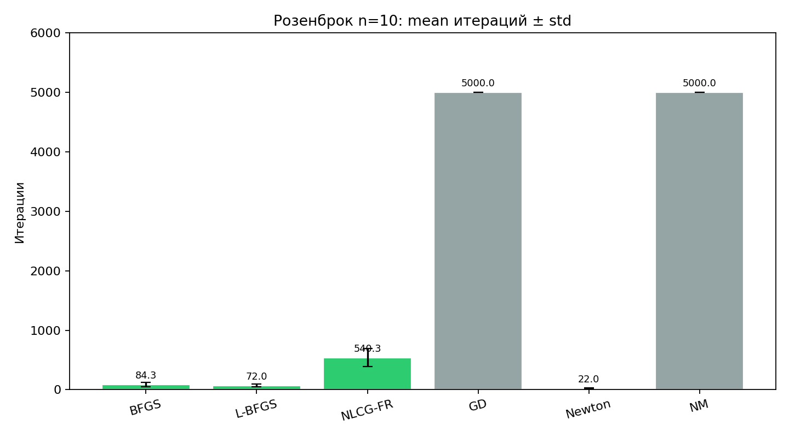
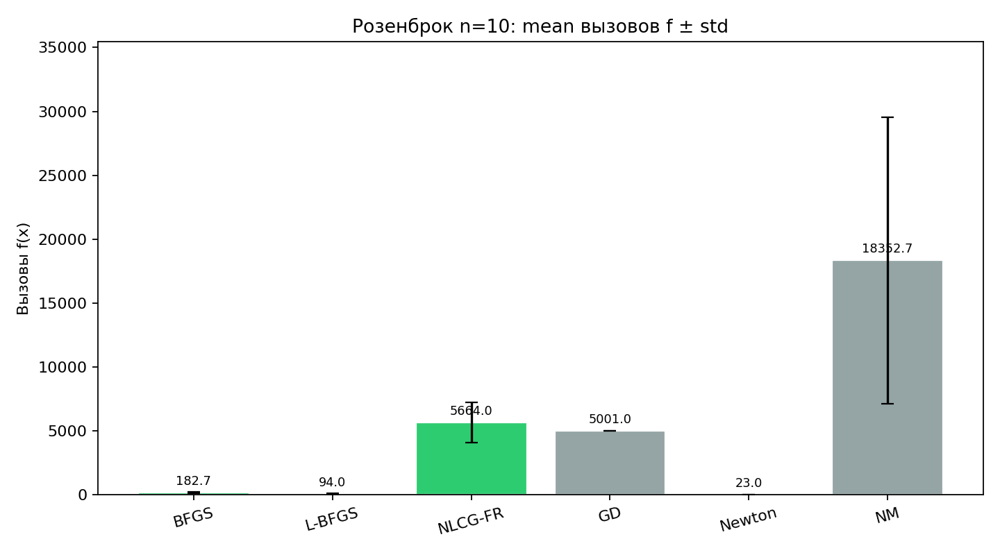
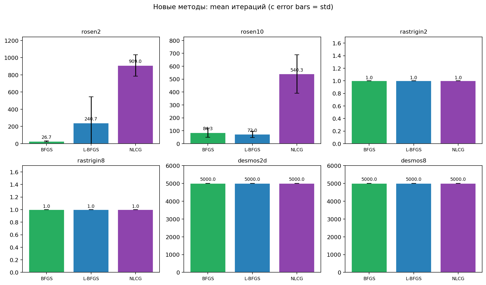
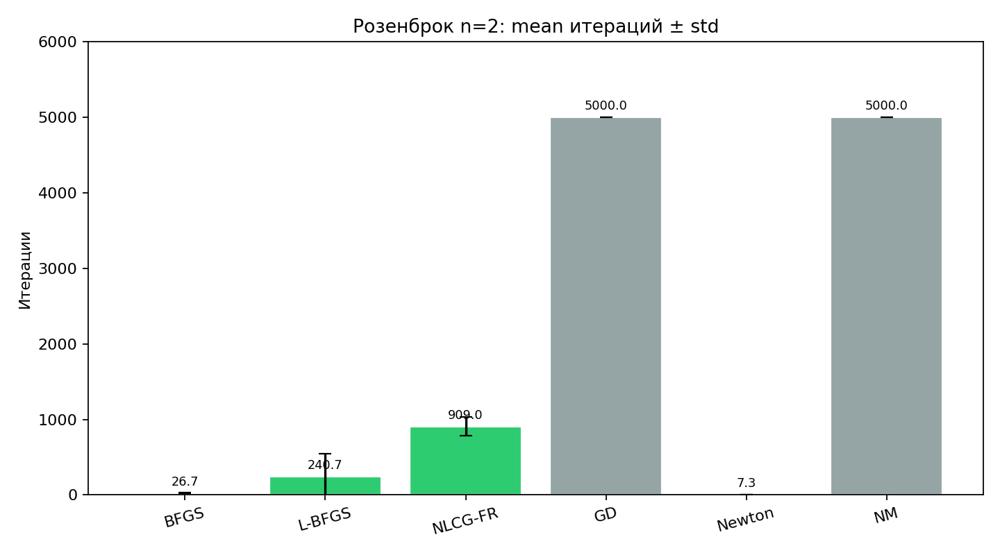
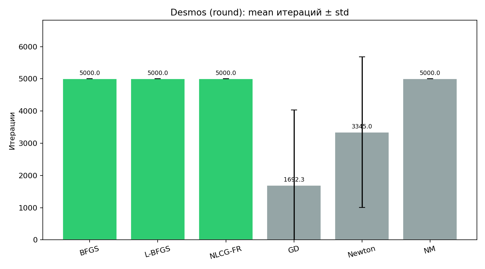
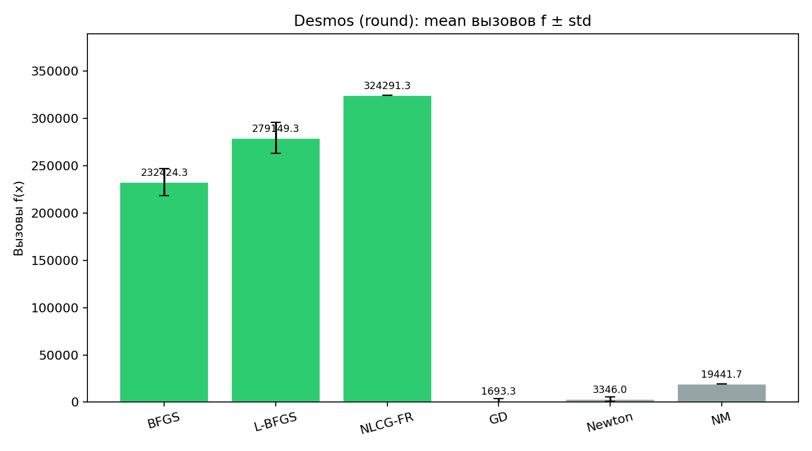

# Лабораторная №2: мультистарт-анализ (mean/variance)

Полная версия в LaTeX: [`lab2_multistart_report.tex`](lab2_multistart_report.tex).  
Основной TeX-отчёт: [`lab2_report.tex`](lab2_report.tex).

## Что изменилось

- Вместо одного старта теперь **3 старта на задачу**.
- Для каждой пары `(функция, метод)` считаются:
  - `mean` и `variance` по `iterations`,
  - `mean` и `variance` по `#f`,
  - `mean` и `variance` по `#∇f`,
  - `mean` и `variance` по `best_f`.
- Экспорт:
  - `lab2/lab2/results/multistart_raw.csv`
  - `lab2/lab2/results/multistart_agg.csv`

## Параметры

- `tol = 1e-8`
- `max_iter = 5000`
- `GD` шаг `1e-3`
- `L-BFGS` память `m = 12`
- `Armijo`: `c1 = 1e-4`, `rho = 0.5`
- Для `Desmos round` градиент численный (центральные разности, `h=1e-6`).

## Ключевые агрегированные результаты

### Гладкие задачи (основной рейтинг)

#### Rosenbrock 2D (mean iters)
- `newton`: **7.33** (var 1.56)
- `bfgs`: **26.67** (var 42.89)
- `lbfgs`: 240.67 (var 93026.89)
- `nlcg_fr`: 909.00 (var 15740.67)
- `gd`: **5000.00** (упор в лимит)

#### Rosenbrock 10D (mean iters)
- `newton`: **22.00** (var 112.67)
- `lbfgs`: **72.00** (var 592.67)
- `bfgs`: 84.33 (var 1236.22)
- `nlcg_fr`: 540.33 (var 22242.89)
- `gd`: **5000.00** (упор в лимит)

#### Rastrigin 2D / 8D (mean iters)
- `bfgs`, `lbfgs`, `nlcg_fr`: **1.00**
- `newton`: 2.67
- `gd`: 48.00 (2D), 60.33 (8D)
- `nelder_mead`: 5000.00

**Итог по гладким задачам:** при усреднении по 3 стартам `GD` стабильно проигрывает новым методам на Розенброке (и по итерациям, и по вызовам функции). На Растригине новые методы остаются лучшими в рамках выбранных стартов.

### Desmos round (отдельный блок, без включения в основной рейтинг новых методов)

#### Desmos 2D (mean iters)
- `bfgs`, `lbfgs`, `nlcg_fr`: **5000.00** (все упираются в лимит)
- `gd`: 1692.33 (var 5.47e6)
- `newton`: 3345.00 (var 5.48e6)
- `nelder_mead`: 5000.00

#### Desmos 8D (mean iters)
- `bfgs`, `lbfgs`, `nlcg_fr`: **5000.00**
- `gd`: 1692.00
- `newton`: 1681.33
- `nelder_mead`: 5000.00

Для `Desmos round` квазиньютоновские методы помечаются как **нестабильные на кусочно-гладкой цели с численным градиентом**, поэтому в итоговом «гладком» сравнении не используются.

## Графики (обновлённые, mean ± std)

- `plots/rosen10_iters.png`
- `plots/rosen10_func_calls.png`
- `plots/new_methods_iters_all.png`
- `plots/rosen2_new_triple.png`
- `plots/desmos2d_iters_compare.png`
- `plots/desmos2d_func_calls_compare.png`













## Воспроизведение

```bash
cd lab2/lab2
cargo run --release
cd ..
python3 plots/generate_charts.py
```
